# Алгоритм проверки проходимости уровня  

В целом, весь алгоритм проверки заключается в обходе в ширину.  

---  
## Алгоритм BFS (поиск в ширину)  

### Описание  
Алгоритм поиска в ширину (BFS) — это метод обхода или поиска в графе, который начинает с заданной вершины (или узла) и исследует все соседние вершины на одном уровне перед переходом к следующему уровню. Он использует очередь для хранения вершин, которые нужно обработать.  
### Шаги алгоритма  
  
1. Инициализируем очередь `queue`, множество `reached` (для отслеживания посещенных вершин) и словарь `parents` (для хранения родительских вершин).  
2. Добавляем начальную вершину `source_point` в очередь и в множество `reached`.  
3. Пока очередь не пуста:  
   - Извлекаем текущую вершину `current` из очереди.  
   - Если значение в ячейке `board[current[1]][current[0]]` равно `point_type`, возвращаем `current`.  
   - Для каждого соседа `p` вершины `current` (окрестность  фон Неймана):  
      - Проверяем, что `p` находится в пределах доски (`0 <= p[1] < len(board)` и `0 <= p[0] < len(board[0])`).  
      - Проверяем, что значение в ячейке `board[p[1]][p[0]]` не находится в списке `restritions`.  
      - Если `p` еще не посещена, добавляем ее в очередь, в множество `reached` и устанавливаем `parents[p] = current`.  
4.  В случае если не удалось добраться до запрашиваемой точки возвращаем `[]`.

## Проверка проходимости на примере проверки сбора сокровищ

### Шаги

1. Из сюжета уровня получаем необходимое количество сокровищ/ключей:
    
    ```py
    "plot": [
       {
          "keys": 2,
          "coins": 11,
          "escape2": true
       }
    ]
    ```
    
2. Принимаем проходы в сокровищницы за `restritions = ["d","#"]`, чтобы первый проход в ширину не заходил в них. То есть мы ищем хотя бы 1 ключ, который не находится в закрытых помещениях. Если нашли, то удаляем найденный ключ из копии уровня.
    
3. Далее запускаем проходы в ширину ( игнорируя двери `restritions = ["#"]` ). С каждым найденным ключом уменьшаем количество необходимых ключей на 1. Если функция `bfs(board, source_point, point_type, restritions)` возвращает пустой список (`[]`), это будет свидетельствовать о том, что либо на карте не хватает ключей, либо хотя бы до 1 ключа не удается добраться.
    

**Проверки остальных условий выполняются аналогично.**

**Далее приведены различные варианты непроходимых уровней и заключение программы проверки.**
# Сюжет
```py
"plot": [
    {
      "keys": 2,
      "coins": 11,
      "escape2": true
    }
]

"map": 0,
"steps": 10000,
"start": [
    14,
    14
]
```
Необходимо найти 2 сокровища, чтобы собирать сокровища нужно подбирать ключи. 
Необходимо собрать 11 *. Сбегите с локации. Чтобы активировать выход нужно переключить рычаг.

# Вариант 1 
 **Проходимый уровень**

```py
playability = True
```

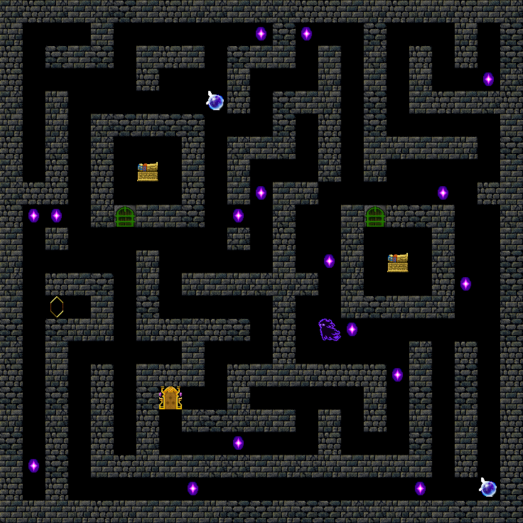  

# Вариант 2 
 **Проходимый уровень.**
 
**Количество монет на карте без излишков.**

```py
playability = True
```

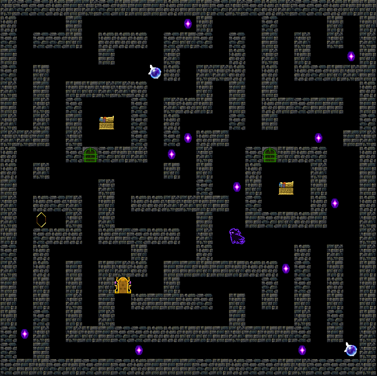  

# Вариант 3 
 **Непроходимый уровень.**
 
**Игрок в замкнутом пространстве без возможности достижения любой цели.**

```py
playability = False
```

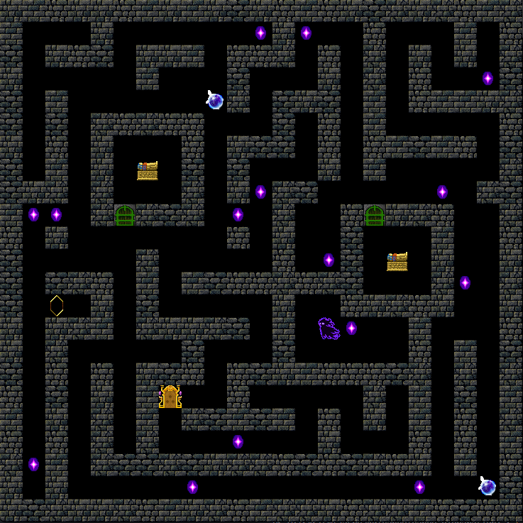  

# Вариант 4 
 **Непроходимый уровень.**

 **Один из ключей не достигаем.**

```py
playability = False
```

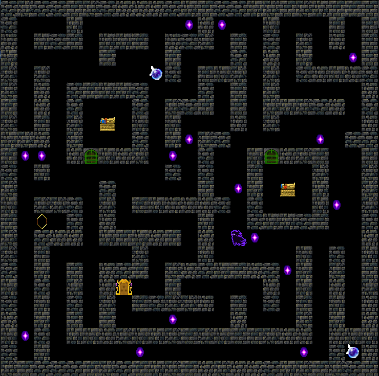  

# Вариант 5 
 **Непроходимый уровень.**

 **Недостаточное количество ключей на карте.**

```py
playability = False
```

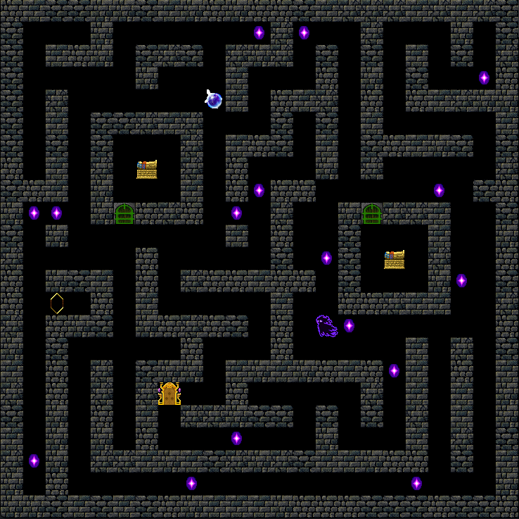  

# Вариант 6 
 **Непроходимый уровень.**

 **Оба ключа не достигаемы.**
```py
playability = False
```

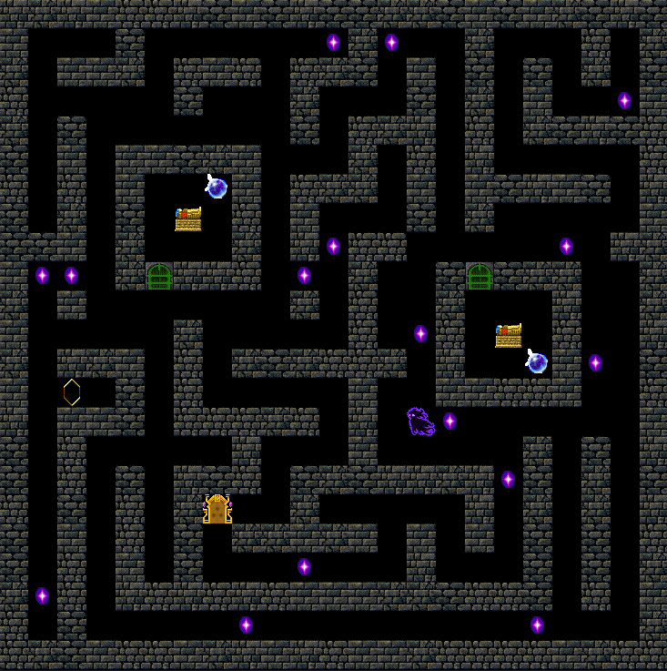  

# Вариант 7 
 **Непроходимый уровень.**

 **Монет на карте достаточно, но некоторые не достигаемы.**
```py
playability = False
```

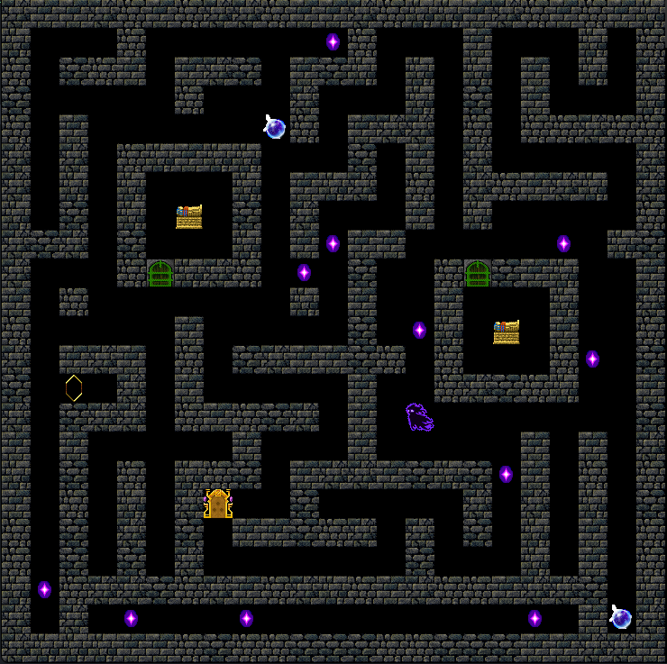  

# Вариант 8 
 **Непроходимый уровень**

 **Монет на карте недостаточно.**
```py
playability = False
```

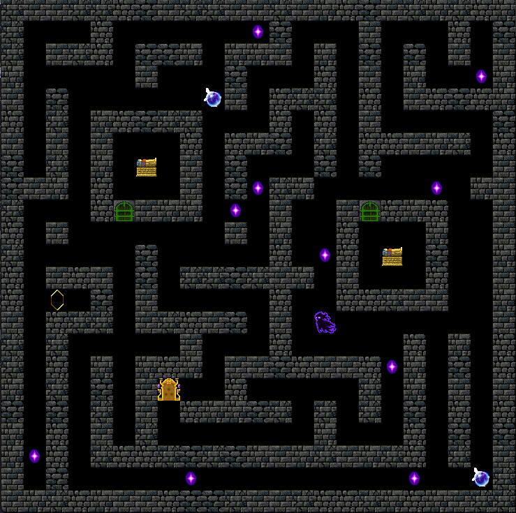  

# Вариант 9 
 **Непроходимый уровень**

 **Отсутствует рычаг.**

```py
playability = False
```

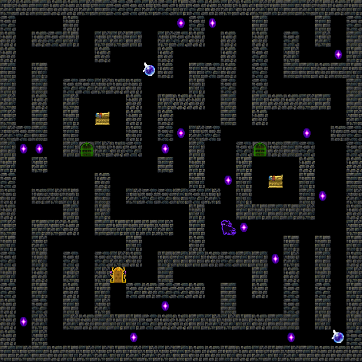  

# Вариант 10 
 **Непроходимый уровень**

 **Рычаг не достигаем.**

```py
playability = False
```

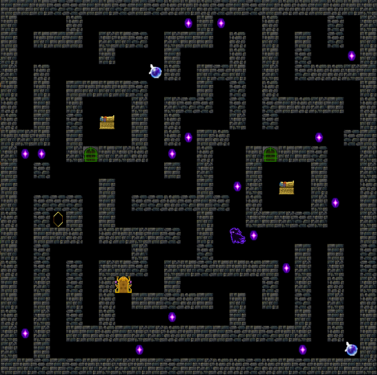  

# Вариант 11 
 **Непроходимый уровень**

 **Отсутствует выход.**

```py
playability = False
```

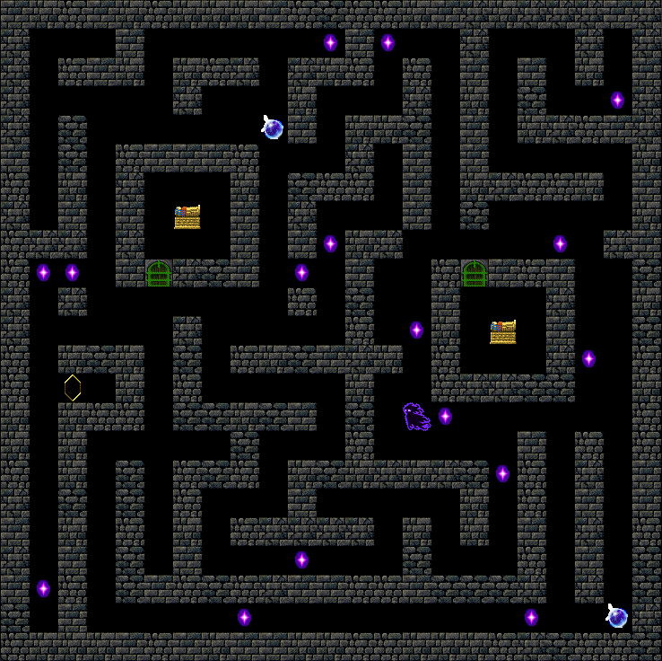  

# Вариант 12 
 **Непроходимый уровень**

 **Выход не достигаем.**
```py
playability = False
```

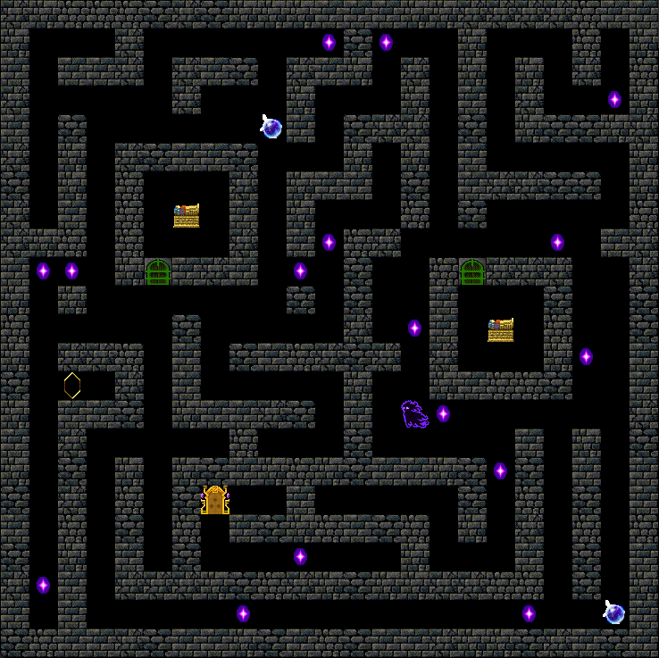
