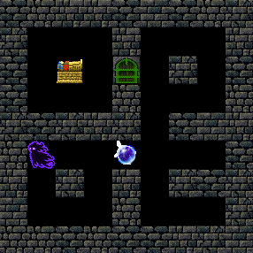
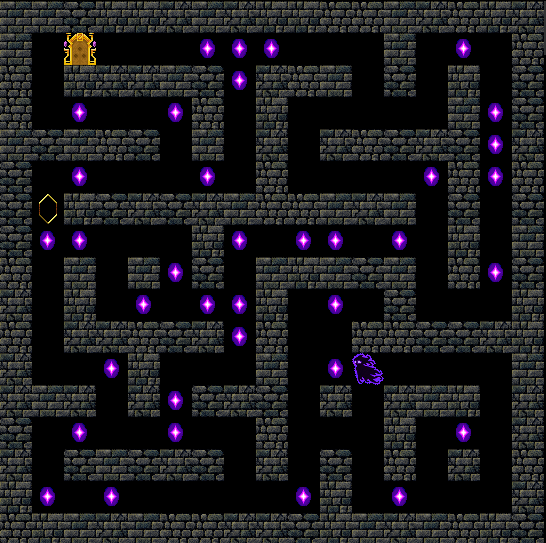
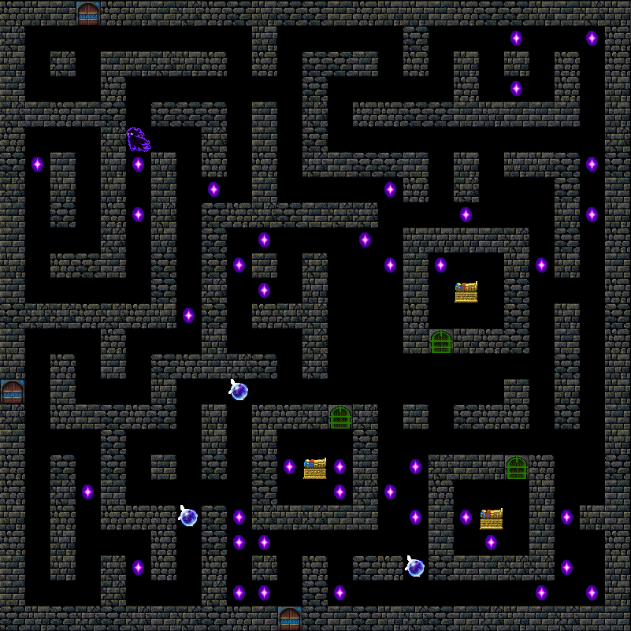
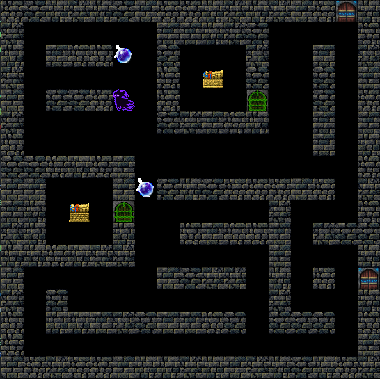
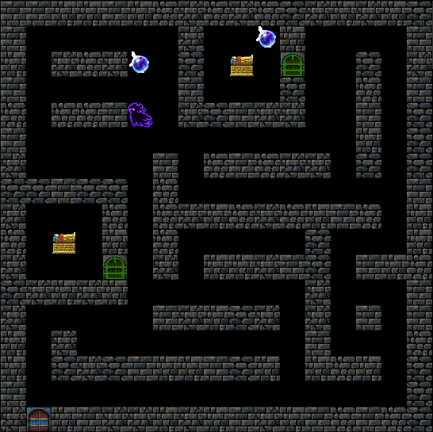

# Новый параметр: сложность.

**Теперь на одной и той же затравке можно создавать головоломки трёх уровней сложности.**
## Пример

Скажем, у нас есть студент группы ИКБО-03-22, решающий 13 задачу и его номер в списке (вариант) = 4
Тогда мы можем сформировать *seed* следующим образом:
```py
seed = sum([ord(i) for i in list(group)]) + task + variant
```
Получим следующее значение: **4499**
Отдельно (пока) константой фиксируется сложность  `difficulty = range(1,4)`

### Уровень сложности 1
**Сюжет: 'treasure' ,  Алгоритм генерации: NoDeadEnds**    

### Уровень сложности 2
**Сюжет:  'exit', 'coins' Алгоритм генерации: NoDeadEnds**    

### Уровень сложности 3
**Сюжет:  'exit', 'treasure', 'coins' Алгоритм генерации: NoDeadEnds**    


### Что можно заметить?

1. Размер карты - зависит от сложности : `width = N*8` , где N - сложность.
2. Как и "насыщенность" сюжета:
```py
for i in range(0, N):  
    while True:  
        temp = random.choice(events)  
        if not (temp in plot):  
            plot.append(temp)  
            break
```

# Пройдёмся по коду
<u>*!-------------------Неактуально-------------------!*</u>
- **Словари** `move` и `actions_dict` просто для удобства.
- **ГПСЧ**:  `def xorshift32`, `class Rand` 
- **Создание начальной карты проходов**: `def options`, `def rule`, `def interp`
- **Починка генерации** (Чтобы по краям карты всегда были стены): `addwalls`
- **Собственно генератор уровня с сюжетом**: `map_generator` 

*Генератор:*
Входные данные:
- seed - затравка для уровня
- difficulty - сложность
- shift=0 - параметр для смещения порядка генерации от затравки в случае, если уровень в процессе генерации оказался непроходимым.
	- Для проверки проходимости создан следующий код:
```py
def bfs(board, source_point, point_type, restritions):  
    queue, reached, parents = [source_point], {source_point}, {}  
    while queue:  
        current = queue.pop(0)  
        if board[current[1]][current[0]] == point_type:  
            return current  
        # Окрестность фон Неймана  
        for dx, dy in [(1, 0), (0, 1), (-1, 0), (0, -1)]:  
            p = (current[0] + dx, current[1] + dy)  
            if 0 <= p[1] < len(board) and 0 <= p[0] < len(board[0]) and not board[p[1]][p[  
                0]] in restritions and p not in reached:  
                queue.append(p)  
                reached.add(p)  
                parents[p] = current  
    return []  
  
  
def check_level(board, spawn, plot):  
    spawn = tuple(spawn)  
  
    # Проходимость уровня  
    playability = True  
  
    # Цикл проверки  
    for P, v in plot.items():  
        if not playability:  
            break  
  
        match P:  
            case "keys":  
                if v > 1:  
                    # Найдём первый ключ (из условия генерации точно находится вне сокровищниц)  
                    point = bfs(board, spawn, "k", ["#", "d"])  
                    if point:  
                        # Подобрали ключ  
                        board[point[1]][point[0]] = " "  # Заменяем "k" на " "  
                        v -= 1  
                        # Пока ключи есть на карте  
                        while v:  
                            point = bfs(board, spawn, "k", ["#"])  
                            if point:  
                                board[point[1]][point[0]] = " "  # Заменяем "k" на " "  
                                v -= 1  
                            else:  
                                playability = False  
                                break                    else:  
                        playability = False  
  
                else:  
                    if not bfs(board, spawn, "k", ["#", "d"]):  
                        playability = False  
  
            case "coins":  
                while v:  
                    point = bfs(board, spawn, "1", ["#"])  
                    if point:  
                        board[point[1]][point[0]] = " "  # Заменяем "1" на " "  
                        v -= 1  
                    else:  
                        playability = False  
                        break  
            case "escape2":  
                point = bfs(board, spawn, "l", ["#"])  
                if point:  
                    board[point[1]][point[0]] = " "  # Заменяем "l" на " "  
                else:  
                    playability = False  
                    break                point = bfs(board, spawn, "x", ["#"])  
                if point:  
                    board[point[1]][point[0]] = " "  # Заменяем "x" на " "  
                else:  
                    playability = False  
                    break  
            case "escape1":  
                while v:  
                    point = bfs(board, spawn, "E", ["#"])  
                    if point:  
                        board[point[1]][point[0]] = " "  # Заменяем "E" на " "  
                        v -= 1  
                    else:  
                        playability = False  
                        break  
    return playability
```
## Проверка, что код игрока в итоге прошел уровень
```py
win = True  
if "coins" in data_for_check:  
    if coins < int(data_for_check["coins"]): win = False  
if "exit" in data_for_check:  
    if escaped != 1: win = False  
if "treasure" in data_for_check:  
    if treasures != int(data_for_check["treasure"]): win = False  
return win
```


## Корректировка сокровищниц
```py
# G fix
        if x == 3:
            x -= 1
        elif x == width - 4:
            x += 1
        if y == height - 4:
            y += 1
        elif y == 3:
            y -= 1
```
**Before:** 

**After:**
